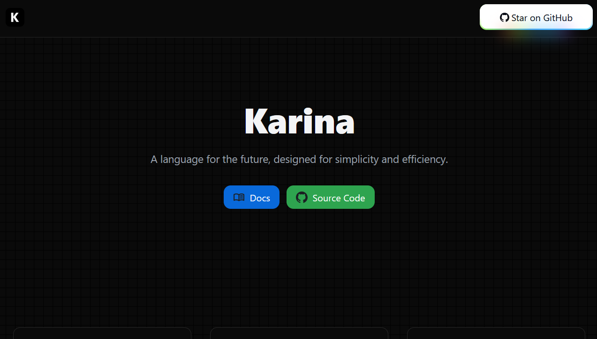

<!--

-->

🚀 **Currently working on:**  
**Karina** — a statically-typed programming language that compiles to Java bytecode, inspired by modern code semantics.

 

 

[Learn more about Karina](https://karina-lang.org/)

 

<!--
**Plixo2/Plixo2** is a ✨ _special_ ✨ repository because its `README.md` (this file) appears on your GitHub profile.

Here are some ideas to get you started:

- 🔭 I’m currently working on ...
- 🌱 I’m currently learning ...
- 👯 I’m looking to collaborate on ...
- 🤔 I’m looking for help with ...
- 💬 Ask me about ...
- 📫 How to reach me: ...
- 😄 Pronouns: ...
- ⚡ Fun fact: ...
-->
